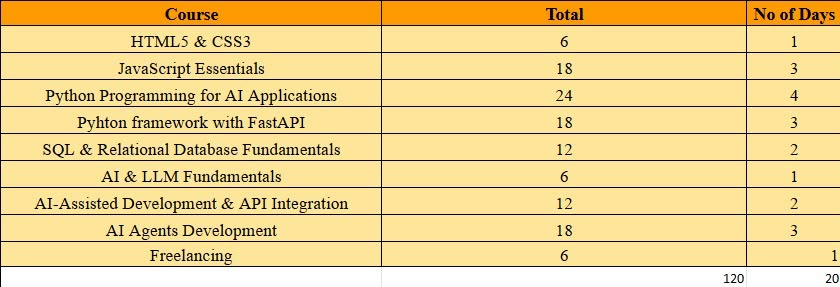
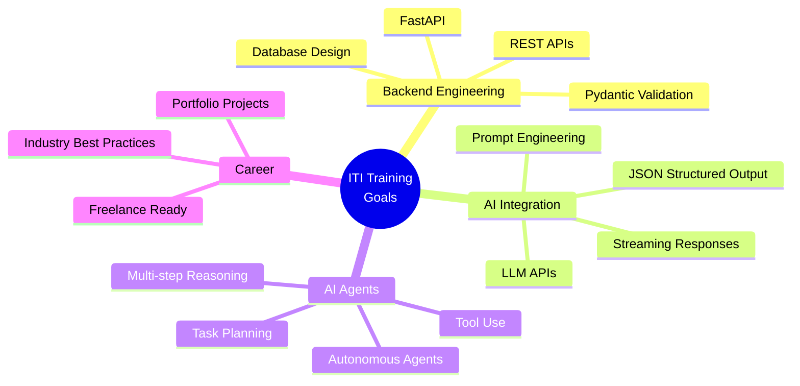

<div align="center">

<!-- Dynamic Header -->


<!-- Typing Animation -->
<a href="https://git.io/typing-svg">
  
</a>

<br/>

<!-- Badges -->


<br/>


</div>

---

<!-- Table of Contents -->
<details open>
<summary><h2>📑 Table of Contents</h2></summary>

- [🎯 About This Repository](#-about-this-repository)
- [🖼️ Track Overview](#️-track-overview)
- [🛠️ Tech Stack & Tools](#️-tech-stack--tools)
- [📊 Training Progress](#-training-progress)
- [📂 Repository Structure](#-repository-structure)
- [📚 Course Curriculum](#-course-curriculum)
- [🧩 Key Projects & Highlights](#-key-projects--highlights)
- [🏆 Goals & Learning Outcomes](#-goals--learning-outcomes)
- [⚡ Quick Start](#-quick-start)
- [🤝 Connect With Me](#-connect-with-me)

</details>

---

## 🎯 About This Repository

> 📌 This repository documents my journey through the **Information Technology Institute (ITI) Summer Training 2026** — a **120-hour intensive track** focused on **AI Agents Development using Python**.

The program bridges the gap between **Full-Stack Web Development** fundamentals, backend engineering with **FastAPI**, and cutting-edge **Artificial Intelligence** applications, culminating in building autonomous AI Agents.

## 🖼️ Track Overview

<div align="center">
  
</div>

---

## 🛠️ Tech Stack & Tools

<div align="center">

<!-- Animated skill icons -->
<a href="https://skillicons.dev">
  
</a>

</div>

<br/>

<div align="center">

| Category | Technologies |
| :--- | :--- |
| **Languages** | Python 3.12+ · JavaScript ES6+ · HTML5 · CSS3 · SQL |
| **Frameworks** | FastAPI · Uvicorn · Pydantic |
| **Databases** | PostgreSQL |
| **AI & LLMs** | Google Gemini API · OpenAI API · LangChain · Prompt Engineering |
| **Tools** | Git · GitHub · VS Code · Jupyter Notebook · Swagger/OpenAPI |

</div>

---

## 📊 Training Progress

<div align="center">

```
Overall Progress  █████████████████░░░░  85%  (102 / 120 hours)
████████████████████████████████████████████████████████████████
```

</div>

| # | Phase | Status | Progress | Hours |
| :---: | :--- | :---: | :--- | :---: |
| 01 | 🌐 HTML5 & CSS3 | ✅ Done | `████████████████████` 100% | 6/6 |
| 02 | ⚡ JavaScript Essentials | ✅ Done | `████████████████████` 100% | 18/18 |
| 03 | 🐍 Python Programming for AI | ✅ Done | `████████████████████` 100% | 24/24 |
| 04 | 🗄️ SQL & Relational Databases | ✅ Done | `████████████████████` 100% | 18/18 |
| 05 | 🧠 AI & LLM Fundamentals | ✅ Done | `████████████████████` 100% | 6/6 |
| 06 | 🔌 AI-Assisted Dev & API Integration | ✅ Done | `████████████████████` 100% | 12/12 |
| 07 | 🤖 AI Agents Development | ✅ Done | `████████████████████` 100% | 18/18 |
| 08 | 🚀 Python Framework (FastAPI) | ⏳ Active | `██████░░░░░░░░░░░░░░` 33% | 6/18 |
| 09 | 💼 Freelancing | 🔜 Soon | `░░░░░░░░░░░░░░░░░░░░` 0% | 0/6 |

---

## 📂 Repository Structure

<details>
<summary><strong>🌐 Phase 1 — Web Fundamentals (HTML & CSS)</strong> &nbsp; <code>6 hours</code></summary>
<br/>

| Session | Topic | Description | Resources |
| :--- | :--- | :--- | :---: |
| 📁 [Session 01](./Session%2001%20-%20Html%26CSS) | HTML & CSS Basics | Introduction to HTML structure, semantic elements, and CSS fundamentals | 📄 Lecture + Lab |
| 📁 [Session 02](./Session%2002%20-%20Html%26CSS) | Advanced HTML5 & CSS3 | Responsive design, Flexbox, CSS Grid, and advanced styling techniques | 📄 Lecture + Lab |

</details>

<details>
<summary><strong>⚡ Phase 2 — JavaScript Essentials</strong> &nbsp; <code>18 hours</code></summary>
<br/>

| Session | Topic | Description | Resources |
| :--- | :--- | :--- | :---: |
| 📁 [Session 03](./Session%2003%20-%20JS) | JS Fundamentals | Variables, data types, operators, control flow, and problem-solving labs | 📄 Lecture + Lab |
| 📁 [Session 04](./Session%2004%20-%20JS) | JS Advanced Concepts | Functions, scope, closures, and advanced logic | 📄 Lecture + Lab |
| 📁 [Session 05](./Session%205%20-%20JS) | DOM Manipulation | DOM traversal, event handling, and dynamic page interactions | 📄 Lecture + Lab |
| 📁 [Session 06](./Session%206%20-%20JS) | Arrays & Strings | Array methods, string manipulation, and custom utility functions | 📄 Lecture + Lab |
| 📁 [Session 07](./Session%207%20-%20JS) | Advanced DOM Projects | Advanced DOM manipulation, interactive To-Do list organizer | 📄 Lecture + Lab |

</details>

<details>
<summary><strong>🐍 Phase 3 — Python Programming for AI</strong> &nbsp; <code>24 hours</code></summary>
<br/>

| Session | Topic | Description | Resources |
| :--- | :--- | :--- | :---: |
| 📁 [Session 08](./Session%2008%20-%20PY) | Python Foundations | Variables, strings, lists, tuples, dictionaries, and Python basics for AI | 📄 Lecture + Lab |
| 📁 [Session 09](./Session%209%20-%20PY) | Python Data Structures | Lists, dictionaries, scope, functions, and practical exercises | 📄 Lecture + Lab |
| 📁 [Session 10](./Session%2010%20-%20PY) | Python Day 3 | Functions, modules, and advanced Python concepts | 📄 Lecture + Lab |
| 📁 [Session 11](./Session%2011%20-%20PY) | OOP in Python | Classes, inheritance, polymorphism, encapsulation, and properties | 📄 Lecture + Lab |
| 📁 [Session 12](./Session%2012%20-%20PY) | Advanced Python | Advanced Python topics and practice | 📄 Lecture + Lab |
| 📁 [Session 13](./Session%2013%20-%20PY) | Python Practical | Practical Labs and Demos | 📄 Lecture + Lab |

</details>

<details>
<summary><strong>🗄️ Phase 4 — SQL & Relational Databases (PostgreSQL)</strong> &nbsp; <code>18 hours</code></summary>
<br/>

| Session | Topic | Description | Resources |
| :--- | :--- | :--- | :---: |
| 📁 [Session 14](./Session%2014%20-%20PostgreSQL) | PostgreSQL Day 1 | Introduction to PostgreSQL and Relational Databases | 📄 Lecture + Lab |
| 📁 [Session 15](./Session%2015-%20PostgreSQL) | PostgreSQL Day 2 | Constraints, Relationships, Referential Integrity, and Labs | 📄 Lecture + Lab |
| 📁 [Session 16](./Session%2016-%20PostgreSQL) | PostgreSQL Day 3 | Advanced queries, joins, aggregations, and practical database solutions | 📄 Lecture + Lab |

</details>

<details>
<summary><strong>🧠 Phase 5 — AI & LLM Fundamentals</strong> &nbsp; <code>6 hours</code></summary>
<br/>

| Session | Topic | Description | Resources |
| :--- | :--- | :--- | :---: |
| 📁 [Session 17](./Session%2017%20-%20GenAI_Prompt_Engineering) | Generative AI & Prompt Engineering | LLM fundamentals, effective prompt engineering, zero-shot and few-shot techniques | 📄 Lecture + Lab |

</details>

<details>
<summary><strong>🔌 Phase 6 — AI-Assisted Dev & API Integration</strong> &nbsp; <code>12 hours</code></summary>
<br/>

| Session | Topic | Description | Resources |
| :--- | :--- | :--- | :---: |
| 📁 [Session 18](./Session%2018%20-%20AIDev_APIIntegration) | API Integration Day 1 | AI-Assisted Development, Gemini & OpenAI API integration | 📄 Lecture + Lab |
| 📁 [Session 19](./Session%2019%20-%20AIDev_APIIntegration) | API Integration Day 2 | Chat memory, structured JSON output, streaming responses, and full AI app | 📄 Lecture + Lab + ✅ Solve |

</details>

<details>
<summary><strong>🤖 Phase 7 — AI Agents Development</strong> &nbsp; <code>18 hours</code></summary>
<br/>

| Session | Topic | Description | Resources |
| :--- | :--- | :--- | :---: |
| 📁 [Session 20](./Session%2020%20-%20AI_Agents_Development) | AI Agents Day 1 | Introduction to Autonomous AI Agents architecture and tool use | 📄 Lecture + Lab |
| 📁 [Session 21](./Session%2021%20-%20AI_Agents_Development) | AI Agents Day 2 | Multi-step reasoning, agent execution loops, and external tool calling | 📄 Lecture + Lab |
| 📁 [Session 22](./Session%2022%20-%20AI_Agents_Development) | AI Agents Day 3 | Advanced autonomous agent workflows, task planning, and evaluation | 📄 Lecture + Lab |

</details>

<details open>
<summary><strong>🚀 Phase 8 — Python Framework (FastAPI)</strong> &nbsp; <code>6/18 hours</code> &nbsp; 🟡 IN PROGRESS</summary>
<br/>

| Session | Topic | Description | Resources |
| :--- | :--- | :--- | :---: |
| 📁 [Session 23](./Session%2023%20FastAPI) | FastAPI Day 1 — Documents REST API | In-memory CRUD operations (`GET`, `POST`, `PUT`, `DELETE`), Query Parameters, HTTP Status Codes, and Swagger UI | 📄 Lecture + Lab + ✅ Solve |

</details>

---

## 📚 Course Curriculum

<div align="center">

| # | Course Module | Hours | Days | Status |
| :---: | :--- | :---: | :---: | :---: |
| 01 | **HTML5 & CSS3** | 6 | 1 | ✅ |
| 02 | **JavaScript Essentials** | 18 | 3 | ✅ |
| 03 | **Python Programming for AI** | 24 | 4 | ✅ |
| 04 | **SQL & Relational Databases** | 18 | 3 | ✅ |
| 05 | **AI & LLM Fundamentals** | 6 | 1 | ✅ |
| 06 | **AI-Assisted Dev & API Integration** | 12 | 2 | ✅ |
| 07 | **AI Agents Development** | 18 | 3 | ✅ |
| 08 | **Python Framework (FastAPI)** | 18 | 3 | ⏳ |
| 09 | **Freelancing** | 6 | 1 | ⏳ |
|  | **Total** | **120** | **20** |  |

</div>

---

## 🧩 Key Projects & Highlights

<div align="center">

| Project | Tech | Description |
| :--- | :--- | :--- |
| 🎨 **Responsive Portfolio** | HTML5 · CSS3 · Flexbox | Fully responsive multi-page portfolio with modern CSS animations |
| ✅ **Interactive To-Do App** | JavaScript · DOM API | Dynamic task manager with drag-and-drop, local storage, and filters |
| 🐍 **Python OOP Lab Suite** | Python · OOP | Full OOP project with classes, inheritance, polymorphism, and design patterns |
| 🗄️ **PostgreSQL Database Lab** | SQL · PostgreSQL | Normalized database with complex queries, joins, views, and transactions |
| 🤖 **AI Chat App** | Python · Gemini API | Full chat application with memory, JSON output, and streaming support |
| 🔧 **Autonomous AI Agent** | Python · LangChain | Multi-step reasoning agent with tool use and task planning capabilities |
| 🚀 **Documents REST API** | FastAPI · Pydantic | Complete CRUD REST API with query parameters, validation, and Swagger docs |

</div>

---

## 🏆 Goals & Learning Outcomes

<div align="center">



</div>

---

## ⚡ Quick Start

```bash
# Clone the repository
git clone https://github.com/amrreda123/ITI-AI-Agents-Python-Summer26.git

# Navigate to the project
cd ITI-AI-Agents-Python-Summer26

# Example: Run the FastAPI lab solution
cd "Session 23 FastAPI/Solve"
pip install fastapi uvicorn
uvicorn main:app --reload

# Open Swagger UI at http://127.0.0.1:8000/docs
```

---

## 📈 GitHub Stats

<div align="center">


</div>

<div align="center">


</div>

---

## 🤝 Connect With Me

<div align="center">

[](https://www.linkedin.com/in/amr-reda-b43aa4357)
[](https://www.youtube.com/@Eng_amr_reda)
[](https://facebook.com/share/17byg5qLgk)
[](https://whatsapp.com/channel/0029VbBVYvL3GJP3yRGVia1F)
[](https://github.com/amrreda123)

</div>

---

<div align="center">


<br/>

**⭐ If you find this repository helpful, give it a star!**

<br/>

<i>Developed with ❤️ by <a href="https://github.com/amrreda123">Amr Reda</a></i>

</div>